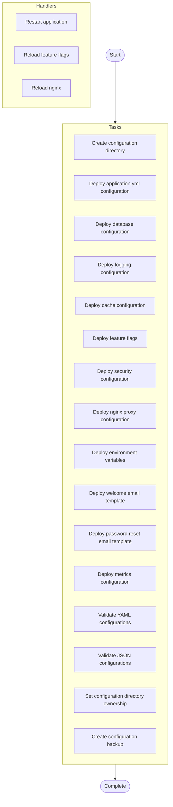

# Application Configuration Management

## Overview

Deploy and manage application configuration files using Jinja2 templates with environment-specific settings

**Hosts**: `app_servers`


**Tags**: configuration, templates, config-management


## Parameters


No documented parameters.


## Warnings


> ⚠️ **Important Notices:**
> 

> - Production configurations contain sensitive data - use Ansible Vault

> - Always validate generated configurations before applying to production

> - Contains sensitive database credentials - restrict permissions


## Usage Examples


```yaml
ansible-playbook configure-app.yml -e "environment=production config_version=2.1.0"
```

```yaml
ansible-playbook configure-app.yml -e "environment=development enable_debug=true"
```


## Tasks

### Pre-Tasks

No pre-tasks defined.


### Main Tasks


- **Create configuration directory** (*file*)
  
  

- **Deploy application.yml configuration** (*template*)
  
  

- **Deploy database configuration** (*template*)
  
  

- **Deploy logging configuration** (*template*)
  
  

- **Deploy cache configuration** (*template*)
  
  

- **Deploy feature flags** (*template*)
  
  

- **Deploy security configuration** (*template*)
  
  

- **Deploy nginx proxy configuration** (*template*)
  
  

- **Deploy environment variables** (*template*)
  
  

- **Deploy welcome email template** (*template*)
  
  

- **Deploy password reset email template** (*template*)
  
  

- **Deploy metrics configuration** (*template*)
  Condition: `metrics_enabled | bool`
  

- **Validate YAML configurations** (*command*)
  
  Loop: `['{{ config_base_path }}/application.yml', '{{ config_base_path }}/metrics.yml']`

- **Validate JSON configurations** (*command*)
  
  Loop: `['{{ config_base_path }}/feature-flags.json']`

- **Set configuration directory ownership** (*file*)
  
  

- **Create configuration backup** (*archive*)
  
  


### Post-Tasks

No post-tasks defined.


### Handlers


- **Restart application** (*systemd*)

- **Reload feature flags** (*command*)

- **Reload nginx** (*systemd*)


## Execution Flow




---

*Documentation generated by Anodyse v0.1.0*

