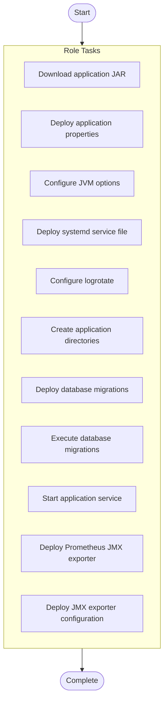

# Application Server Deployment

## Overview

Deploy Java-based enterprise application server with database connectivity

**Tags**: application, deployment, java

## Parameters

No documented parameters.

## Warnings

> ⚠️ **Important Notices:**
> 

> - Requires Java runtime to be installed first

> - Migrations run only on first app server to avoid conflicts

## Usage Examples

No usage examples provided.

## Tasks

- **Download application JAR** (*get_url*)
  
  
- **Deploy application properties** (*template*)
  
  
- **Configure JVM options** (*template*)
  
  
- **Deploy systemd service file** (*template*)
  
  
- **Configure logrotate** (*template*)
  
  
- **Create application directories** (*file*)
  
  Loop: `['{{ app_home }}/config', '{{ app_home }}/logs', '{{ app_home }}/temp', '{{ app_home }}/data']`
- **Deploy database migrations** (*copy*)
  
  
- **Execute database migrations** (*command*)
  Condition: `inventory_hostname == groups['app_servers'][0]`
  
- **Start application service** (*systemd*)
  
  
- **Deploy Prometheus JMX exporter** (*get_url*)
  Condition: `enable_monitoring | default(false) | bool`
  
- **Deploy JMX exporter configuration** (*template*)
  Condition: `enable_monitoring | default(false) | bool`
  

## Execution Flow

---

*Documentation generated by Anodyse v0.1.0*

