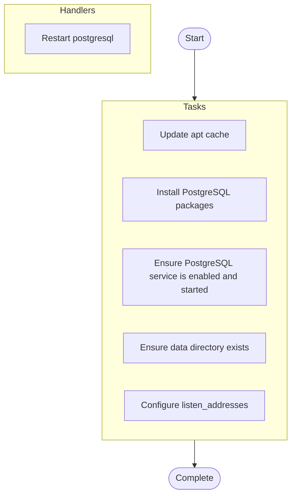

# deploy-unannotated

## Overview

⚠️ **This playbook is undocumented.**

**Hosts**: `databases`

## Parameters

No documented parameters.

## Warnings

No warnings documented.

## Usage Examples

No usage examples provided.

## Tasks

### Pre-Tasks

No pre-tasks defined.

### Main Tasks

- **Update apt cache** (*apt*)
  Condition: `ansible_os_family == "Debian"`
  
- **Install PostgreSQL packages** (*package*)
  
  
- **Ensure PostgreSQL service is enabled and started** (*service*)
  
  
- **Ensure data directory exists** (*file*)
  
  
- **Configure listen_addresses** (*lineinfile*)
  
  

### Post-Tasks

No post-tasks defined.

### Handlers

- **Restart postgresql** (*service*)

## Execution Flow

---

*Documentation generated by Anodyse v0.1.0*

