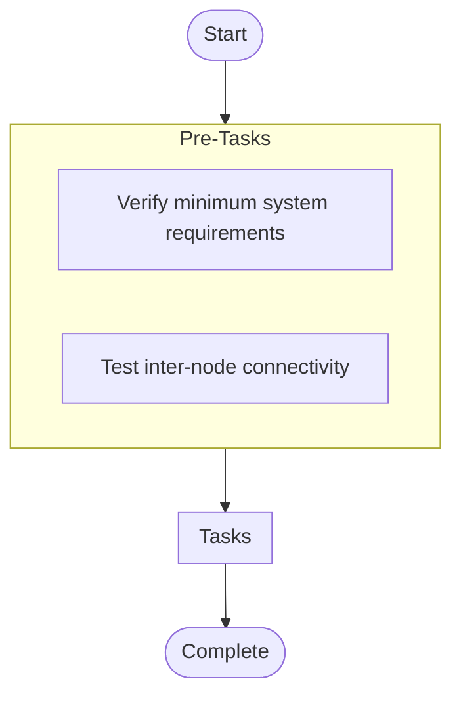

# Enterprise Application Stack Orchestrator

## Overview

Comprehensive deployment of a three-tier enterprise application stack with database cluster, application servers, load balancers, and monitoring

**Hosts**: `database_servers`


**Tags**: enterprise, orchestration, production


## Parameters


| Parameter | Description |
|-----------|-------------|

| `db_cluster_size Number of database nodes in the cluster (default` | 3) |


## Warnings


> ⚠️ **Important Notices:**
> 

> - Production deployments require pre-approval and maintenance window

> - Ensure all prerequisites are met before running this playbook

> - SSL certificates must be deployed separately via secure channel


## Usage Examples


```yaml
ansible-playbook site.yml -e "environment=production app_version=2.1.0"
```

```yaml
ansible-playbook site.yml -e "environment=staging app_version=2.1.0-rc1 enable_monitoring=true"
```


## Tasks

### Pre-Tasks


- **Verify minimum system requirements** (*assert*)
  
  
- **Test inter-node connectivity** (*wait_for*)
  Condition: `inventory_hostname != item`
  Loop: `{{ groups['database_servers'] }}`


### Main Tasks

No tasks defined.


### Post-Tasks

No post-tasks defined.


### Handlers

No handlers defined.


## Execution Flow




---

*Documentation generated by Anodyse v0.1.0*

