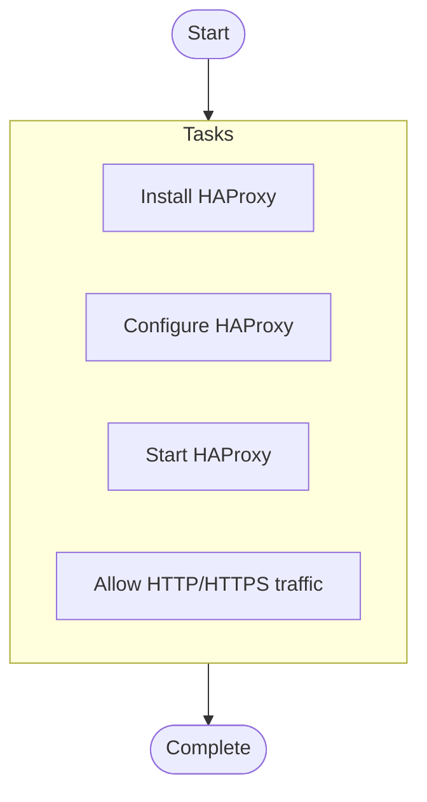

# Multi-Tier Application Stack Deployment

## Overview

Deploy a complete 3-tier application stack with load balancer, app servers, and database

**Hosts**: `loadbalancers`


**Tags**: multi-tier, loadbalancer, high-availability


## Parameters


No documented parameters.


## Warnings


> ⚠️ **Important Notices:**
> 

> - This is a complex multi-host deployment

> - Ensure all host groups are defined in inventory

> - Password should be provided via vault


## Usage Examples


```yaml
ansible-playbook deploy-app-stack.yml -e "environment=prod app_version=1.2.3"
```


## Tasks

### Pre-Tasks

No pre-tasks defined.


### Main Tasks


- **Install HAProxy** (*apt*)
  Condition: `ansible_os_family == "Debian"`
  
- **Configure HAProxy** (*template*)
  
  
- **Start HAProxy** (*service*)
  
  
- **Allow HTTP/HTTPS traffic** (*ufw*)
  
  Loop: `[80, 443]`


### Post-Tasks

No post-tasks defined.


### Handlers

No handlers defined.


## Execution Flow




---

*Documentation generated by Anodyse v0.1.0*

