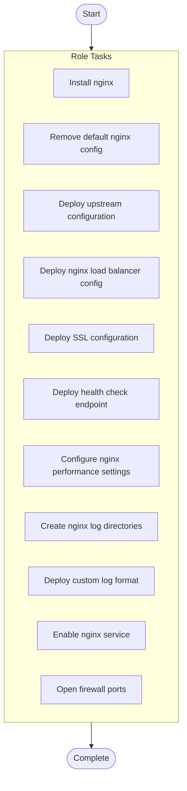

# NGINX Load Balancer Configuration

## Overview

Deploy and configure NGINX as a reverse proxy load balancer with SSL termination

**Tags**: loadbalancer, nginx, ssl

## Parameters

No documented parameters.

## Warnings

> ⚠️ **Important Notices:**
> 

> - SSL certificates must be deployed before running this role

## Usage Examples

No usage examples provided.

## Tasks

| Task | Description | Notes | Warnings | Tags |
|------|-------------|-------|----------|------|
| **Install nginx** *package* | @title Install NGINX @description Install NGINX web server package |  |  | i, n, s, t, a, l, l |
| **Remove default nginx config** *file* | @title Remove default NGINX configuration @description Clean up default site configuration |  |  |  |
| **Deploy upstream configuration** *template* | @title Deploy upstream configuration @description Configure backend application server pool @param backend_servers Array of backend server addresses |  |  |  |
| **Deploy nginx load balancer config** *template* | @title Deploy load balancer configuration @description Configure NGINX virtual host with proxy settings and SSL |  |  |  |
| **Deploy SSL configuration** *template* | @title Configure SSL/TLS settings @description Deploy SSL configuration with modern cipher suites @param ssl_protocols Allowed SSL/TLS protocol versions |  |  |  |
| **Deploy health check endpoint** *template* | @title Configure health check endpoint @description Set up dedicated health check endpoint for load balancer monitoring |  |  |  |
| **Configure nginx performance settings** *lineinfile* | @title Optimize NGINX performance @description Apply performance tuning to nginx.conf |  |  |  |
| **Create nginx log directories** *file* | @title Create log directories @description Ensure log directories exist with proper permissions |  |  |  |
| **Deploy custom log format** *blockinfile* | @title Configure access logs @description Set up structured JSON logging for better log analysis |  |  |  |
| **Enable nginx service** *systemd* | @title Enable and start NGINX @description Ensure NGINX service is running and enabled at boot |  |  |  |
| **Open firewall ports** *firewalld* | @title Configure firewall rules @description Open ports for HTTP and HTTPS traffic |  |  |  |

## Execution Flow

---

*Documentation generated by Anodyse v0.1.0*

