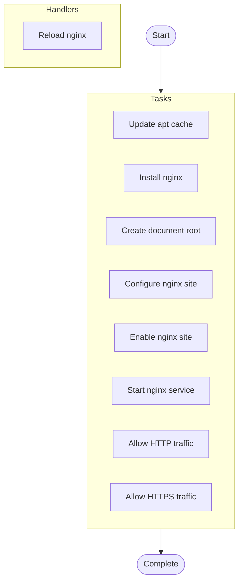

# NGINX Web Server Deployment

## Overview

Deploy and configure NGINX web server with SSL/TLS support and custom site configuration

**Hosts**: `webservers`


**Tags**: web-server, nginx, ssl


## Parameters


| Parameter | Description |
|-----------|-------------|

| `nginx_port Port number for HTTP traffic (default` | 80) |

| `nginx_ssl_port Port number for HTTPS traffic (default` | 443) |


## Warnings


> ⚠️ **Important Notices:**
> 

> - Ensure firewall rules allow traffic on specified ports

> - SSL certificates must be provided separately


## Usage Examples


```yaml
ansible-playbook deploy-nginx.yml -e "site_name=example.com enable_ssl=true"
```


## TODOs

| Location | Author | TODO |
|----------|--------|------|
| File | - | Add support for Let's Encrypt certificate automation |
| File | ops | Implement rate limiting configuration |
| File | - | HTTP/2 configuration needs performance tuning |
| Create document root | - | Consider using official NGINX repository for latest stable version |
| Enable nginx site | devops | Add validation step before deploying configuration |


## Tasks

### Pre-Tasks

No pre-tasks defined.


### Main Tasks


| Task | Description | Notes | Warnings | Tags |
|------|-------------|-------|----------|------|
| **Update apt cache**<br>*apt* |  |  |  |  |
| **Install nginx**<br>*package* | Ensure APT package cache is up-to-date before installation | Cache valid for 1 hour to avoid excessive updates |  | setup |
| **Create document root**<br>*file* | Install NGINX web server from distribution repositories | Uses the distro's default NGINX version for stability |  | install |
| **Configure nginx site**<br>*template* | Ensure the web root directory exists with proper permissions |  | Changing document_root for existing sites may break content paths | filesystem |
| **Enable nginx site**<br>*file* | Configure NGINX virtual host for the specified site | Template should be customized for specific site requirements | This will override any existing configuration for the same site | configuration |
| | *uses Jinja2 template for flexibility* | | | |
| **Start nginx service**<br>*service* | Create symbolic link to enable the site configuration | NGINX uses sites-available/sites-enabled pattern for config management |  | configuration |
| **Allow HTTP traffic**<br>*ufw* | Ensure NGINX is running and starts on boot |  |  | service |
| **Allow HTTPS traffic**<br>*ufw* | Open firewall port for HTTP traffic |  | Ensure this aligns with security policies before opening ports | firewall, security |


### Post-Tasks

No post-tasks defined.


### Handlers


- **Reload nginx** (*service*)


## Execution Flow




---

*Documentation generated by Anodyse v0.1.0*

