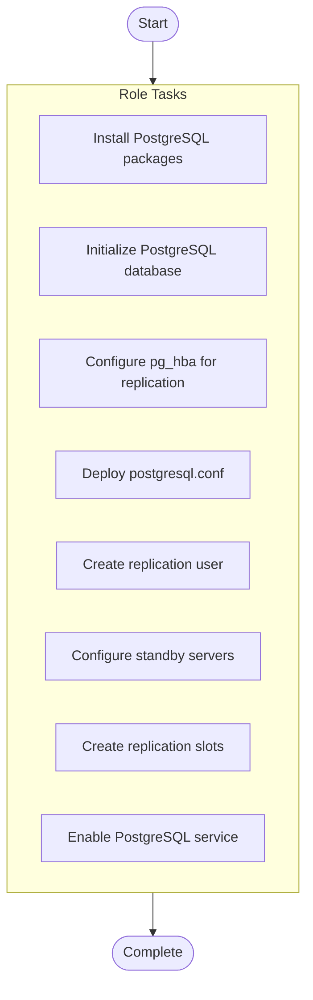

# PostgreSQL Cluster Deployment

## Overview

Configure PostgreSQL database cluster with streaming replication and high availability

**Tags**: database, postgresql, replication

## Parameters

| Parameter | Description |
|-----------|-------------|

| `db_version PostgreSQL version to install (default` | 14) |

## Warnings

> ⚠️ **Important Notices:**
> 

> - Replication passwords must be stored in Ansible Vault

## Usage Examples

No usage examples provided.

## Tasks

| Task | Description | Notes | Warnings | Tags |
|------|-------------|-------|----------|------|
| **Install PostgreSQL packages** *package* |  |  |  | i, n, s, t, a, l, l |
| **Initialize PostgreSQL database** *command* | @title Initialize database cluster @description Create PostgreSQL data directory and initialize database |  |  |  |
| **Configure pg_hba for replication** *postgresql_pg_hba* | @title Configure PostgreSQL authentication @description Set up pg_hba.conf for replication and application access @param replication_subnet CIDR subnet allowed for replication connections |  |  |  |
| **Deploy postgresql.conf** *template* | @title Deploy PostgreSQL configuration @description Apply custom postgresql.conf with performance tuning and replication settings |  |  |  |
| **Create replication user** *postgresql_user* | @title Create replication user @description Set up dedicated user for streaming replication |  |  |  |
| **Configure standby servers** *template* | @title Configure streaming replication @description Set up standby servers with recovery configuration |  |  |  |
| **Create replication slots** *postgresql_slot* | @title Setup replication slots @description Create replication slots on primary for each standby |  |  |  |
| **Enable PostgreSQL service** *systemd* | @title Enable and start PostgreSQL service @description Ensure PostgreSQL is running and enabled at boot |  |  |  |

## Execution Flow

---

*Documentation generated by Anodyse v0.1.0*

