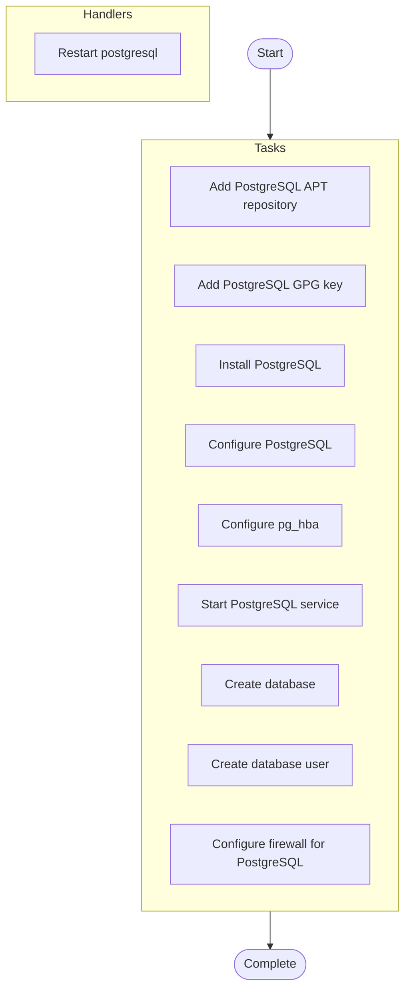

# PostgreSQL Database Server Deployment

## Overview

Install and configure PostgreSQL database server with security hardening

**Hosts**: `dbservers`


**Tags**: database, postgresql, security


## Parameters


| Parameter | Description |
|-----------|-------------|

| `postgres_version PostgreSQL version to install (default` | 14) |

| `postgres_port Database server port (default` | 5432) |

| `allow_remote Enable remote connections (default` | false) |


## Warnings


> ⚠️ **Important Notices:**
> 

> - Remote access is disabled by default for security

> - Ensure strong passwords are used in production


## Usage Examples


```yaml
ansible-playbook deploy-postgresql.yml -e "db_name=myapp db_user=appuser db_password=securepass123"
```


## TODOs

| Location | Author | TODO |
|----------|--------|------|
| File | - | Add automated backup configuration |
| File | dba | Implement connection pooling with PgBouncer |
| File | - | Need to add SSL/TLS configuration for encrypted connections |
| Configure PostgreSQL | - | Add PostgreSQL development packages for extension building |
| Start PostgreSQL service | security | Add support for certificate-based authentication |
| Create database user | - | Add support for custom database encoding and collation |


## Tasks

### Pre-Tasks

No pre-tasks defined.


### Main Tasks


| Task | Description | Notes | Warnings | Tags |
|------|-------------|-------|----------|------|
| **Add PostgreSQL APT repository**<br>*apt_repository* |  |  |  |  |
| **Add PostgreSQL GPG key**<br>*apt_key* | Add official PostgreSQL repository for latest packages | Official repo provides more recent versions than distro defaults |  | setup |
| **Install PostgreSQL**<br>*apt* | Import GPG key for package verification |  | Key verification ensures package authenticity | setup, security |
| **Configure PostgreSQL**<br>*lineinfile* | Install PostgreSQL server and client tools | Python bindings required for Ansible database modules |  | install |
| **Configure pg_hba**<br>*template* | Update PostgreSQL configuration with custom settings | Tune shared_buffers based on available system memory | Changes require service restart to take effect | configuration, performance |
| | *performance tuning for production workloads* | | | |
| **Start PostgreSQL service**<br>*service* | Update pg_hba.conf for client access control | Template should implement principle of least privilege | Restricts connections to local Unix socket by default<br>Review security implications before allowing remote access | configuration, security |
| **Create database**<br>*postgresql_db* | Ensure PostgreSQL service is running and enabled at boot |  |  | service |
| **Create database user**<br>*postgresql_user* | Create a new database for the application | Database created with default encoding and locale |  | database |
| **Configure firewall for PostgreSQL**<br>*ufw* | Create a new database user with authentication | User granted ALL privileges on specified database | Ensure db_password is stored securely (use Ansible Vault)<br>Password will be visible in logs if not properly protected | database, security |


### Post-Tasks

No post-tasks defined.


### Handlers


- **Restart postgresql** (*service*)


## Execution Flow




---

*Documentation generated by Anodyse v0.1.0*

