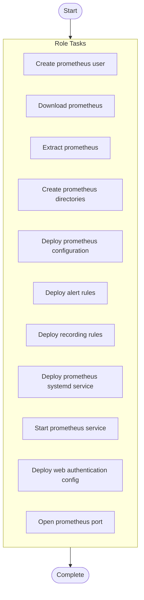

# Prometheus Monitoring Server Setup

## Overview

Deploy and configure Prometheus monitoring server with service discovery

**Tags**: monitoring, prometheus, observability

## Parameters

No documented parameters.

## Warnings

No warnings documented.

## Usage Examples

No usage examples provided.

## Tasks

- **Create prometheus user** (*user*)
  
  
- **Download prometheus** (*get_url*)
  
  
- **Extract prometheus** (*unarchive*)
  
  
- **Create prometheus directories** (*file*)
  
  Loop: `['/etc/prometheus', '/etc/prometheus/rules.d', '/etc/prometheus/targets.d', '/var/lib/prometheus', '/var/log/prometheus']`
- **Deploy prometheus configuration** (*template*)
  
  
- **Deploy alert rules** (*template*)
  
  
- **Deploy recording rules** (*template*)
  
  
- **Deploy prometheus systemd service** (*template*)
  
  
- **Start prometheus service** (*systemd*)
  
  
- **Deploy web authentication config** (*template*)
  Condition: `enable_auth | default(false) | bool`
  
- **Open prometheus port** (*firewalld*)
  Condition: `ansible_os_family == "RedHat"`
  

## Execution Flow

---

*Documentation generated by Anodyse v0.1.0*

