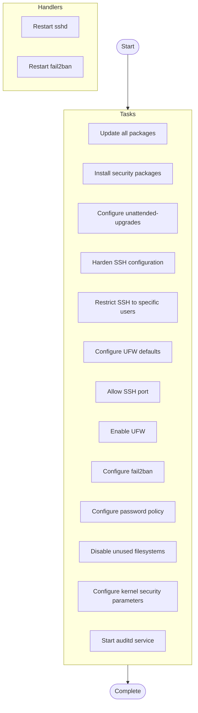

# System Security Hardening

## Overview

Apply security hardening measures to Linux systems following CIS benchmarks

**Hosts**: `all`


**Tags**: security, hardening, compliance


## Parameters


| Parameter | Description |
|-----------|-------------|

| `ssh_port Custom SSH port (default` | 22) |


## Warnings


> ⚠️ **Important Notices:**
> 

> - This playbook will modify critical system security settings

> - Test in non-production environment first

> - Ensure you have alternative access before disabling root SSH

> - Changes require SSH service restart

> - Only users in this list can SSH to the system

> - This will block all incoming traffic except explicitly allowed

> - Active SSH sessions may be affected


## Usage Examples


```yaml
ansible-playbook harden-system.yml -e "ssh_port=2222 disable_root_ssh=true"
```


## Tasks

### Pre-Tasks

No pre-tasks defined.


### Main Tasks


- **Update all packages** (*apt*)
  Condition: `ansible_os_family == "Debian"`
  
- **Install security packages** (*apt*)
  Condition: `ansible_os_family == "Debian"`
  
- **Configure unattended-upgrades** (*copy*)
  
  
- **Harden SSH configuration** (*lineinfile*)
  
  Loop: `[{'regexp': '^#?Port\\s', 'line': 'Port {{ ssh_port }}'}, {'regexp': '^#?PermitRootLogin\\s', 'line': "PermitRootLogin {{ 'no' if disable_root_ssh else 'yes' }}"}, {'regexp': '^#?PasswordAuthentication\\s', 'line': 'PasswordAuthentication no'}, {'regexp': '^#?PubkeyAuthentication\\s', 'line': 'PubkeyAuthentication yes'}, {'regexp': '^#?PermitEmptyPasswords\\s', 'line': 'PermitEmptyPasswords no'}, {'regexp': '^#?X11Forwarding\\s', 'line': 'X11Forwarding no'}, {'regexp': '^#?MaxAuthTries\\s', 'line': 'MaxAuthTries 3'}, {'regexp': '^#?ClientAliveInterval\\s', 'line': 'ClientAliveInterval 300'}, {'regexp': '^#?ClientAliveCountMax\\s', 'line': 'ClientAliveCountMax 2'}]`
- **Restrict SSH to specific users** (*lineinfile*)
  Condition: `allowed_ssh_users | length > 0`
  
- **Configure UFW defaults** (*ufw*)
  Condition: `enable_firewall | bool`
  Loop: `[{'direction': 'incoming', 'policy': 'deny'}, {'direction': 'outgoing', 'policy': 'allow'}]`
- **Allow SSH port** (*ufw*)
  Condition: `enable_firewall | bool`
  
- **Enable UFW** (*ufw*)
  Condition: `enable_firewall | bool`
  
- **Configure fail2ban** (*copy*)
  Condition: `enable_fail2ban | bool`
  
- **Configure password policy** (*lineinfile*)
  
  Loop: `[{'regexp': '^PASS_MAX_DAYS', 'line': 'PASS_MAX_DAYS {{ password_max_age }}'}, {'regexp': '^PASS_MIN_DAYS', 'line': 'PASS_MIN_DAYS 7'}, {'regexp': '^PASS_MIN_LEN', 'line': 'PASS_MIN_LEN {{ password_min_length }}'}, {'regexp': '^PASS_WARN_AGE', 'line': 'PASS_WARN_AGE 7'}]`
- **Disable unused filesystems** (*kernel_blacklist*)
  
  Loop: `['cramfs', 'freevxfs', 'jffs2', 'hfs', 'hfsplus', 'udf']`
- **Configure kernel security parameters** (*sysctl*)
  
  Loop: `[{'name': 'net.ipv4.conf.all.accept_source_route', 'value': '0'}, {'name': 'net.ipv4.conf.default.accept_source_route', 'value': '0'}, {'name': 'net.ipv4.conf.all.accept_redirects', 'value': '0'}, {'name': 'net.ipv4.conf.default.accept_redirects', 'value': '0'}, {'name': 'net.ipv4.icmp_echo_ignore_broadcasts', 'value': '1'}, {'name': 'net.ipv4.icmp_ignore_bogus_error_responses', 'value': '1'}, {'name': 'net.ipv4.tcp_syncookies', 'value': '1'}, {'name': 'kernel.randomize_va_space', 'value': '2'}]`
- **Start auditd service** (*service*)
  
  


### Post-Tasks

No post-tasks defined.


### Handlers


- **Restart sshd** (*service*)

- **Restart fail2ban** (*service*)


## Execution Flow




---

*Documentation generated by Anodyse v0.1.0*

